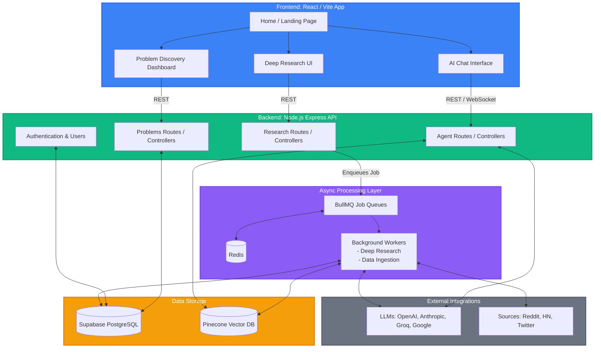

# Beseekr: A Comprehensive Platform Analysis

## 1. Introduction

**Beseekr** (internally developed as `prompt-weaver-desk` for frontend and `multi-agent-system-api` for backend) is a highly sophisticated, AI-driven platform tailored for ambitious builders, founders, and product teams. The platform's primary mission is to compress weeks of market research and problem validation into mere minutes. By analyzing real conversations across the internet, Beseekr acts as a powerful co-pilot that surfaces validated pain points and provides deep insights to help entrepreneurs build solutions that people actually need.

## 2. Platform Offerings: The Tool Suite

The journey begins at the Beseekr Home Page, which presents the user with a suite of robust, AI-powered tools designed to tackle different phases of product development and research:

### A. AI Chat (The Orchestrator)

- **What it is:** A comprehensive conversational interface to craft, refine, and weave complex prompts.
- **Features:** It supports multi-turn conversations and agent-based workflows. Users can command various AI agents to brainstorm, write code, or perform strategic research at scale.
- **Backend Power:** Powered by an array of LLM providers (Anthropic, OpenAI, Groq, Google Generative AI) and deeply integrated with custom agent controllers that support bulk operations, prompt enhancements, and templated workflows.

### B. Problem Discovery (The Idea Engine)

- **What it is:** An engine that surfaces validated startup problems sourced from communities like Reddit, Hacker News, and Twitter.
- **Features:** Problems are automatically scored by AI for their "Opportunity Potential." Users can view trending pain points, market validation data, and competitor/pricing intelligence.
- **Backend Power:** Driven by aggressive background ingestion scripts (`ingestSubreddits.js`, `ingestHn.js`, etc.) that pull conversational data. This data is processed, scored, and stored in a Supabase (PostgreSQL) database, allowing users to filter by hot, trending, or highest opportunity scores.

### C. Idea Validation & Deep Research (The Analyst)

- **What it is:** When a user has an idea, they can feed it into Beseekr to receive a highly detailed market validation report in under 60 seconds.
- **Features:** Computes Total Addressable Market (TAM), Serviceable Addressable Market (SAM), and Serviceable Obtainable Market (SOM). It outputs competitive landscapes, risk assessments, willing-to-pay (WTP) pricing signals, and Go-To-Market (GTM) strategies.
- **Backend Power:** This heavy computational task is offloaded to a background worker system using BullMQ and Redis (`researchRoutes.js`). The asynchronous deeply-researched jobs eventually yield rich structured reports which the frontend continuously polls for status.

---

## 3. Technical Architecture Overview

The application follows a modern, decoupled client-server architecture utilizing Serverless/BaaS tooling combined with a dedicated Node.js processing backend to handle intensive AI tasks.

### Frontend (`prompt-weaver-desk`)

- **Framework:** React 18 built with Vite and TypeScript.
- **Styling & UI:** Tailwind CSS combined with Radix UI components for a highly polished, accessible, and premium design system. Framer Motion handles the smooth animations that give the platform its "wow" factor.
- **State Management & Routing:** Uses React Router for deep client-side routing, protected routes for authenticated areas, and React Query (`@tanstack/react-query`) for efficient data fetching, caching, and polling (crucial for long-running research jobs).

### Backend (`agent-backend`)

- **Server:** Node.js with Express v5.
- **Database architecture:** Supabase (PostgreSQL) is the primary relational database holding users, problems, job statuses, and metadata. Pinecone is utilized as the Vector Database for semantic search and RAG capabilities over massive datasets of ingested conversations.
- **Job Queues:** BullMQ combined with Redis handles long-form background tasks, such as deep research request generation and bulk data ingestion, preventing the API from timing out during massive AI queries.
- **Integrations:** Razorpay for payments/premium access gating, Resend/SendGrid for email communications, and Telegram/WebSockets for real-time notifications.

---

## 4. Technical Architecture Diagram

## 5. Conclusion

Beseekr is an masterfully architected platform that solves a deep pain point for entrepreneurs: validating ideas before investing time and money. By tying together responsive, aesthetically rich UI components on the frontend with highly scalable asynchronous workers and multi-LLM orchestration on the backend, the platform transitions the product discovery phase from guesswork to a data-driven science.
